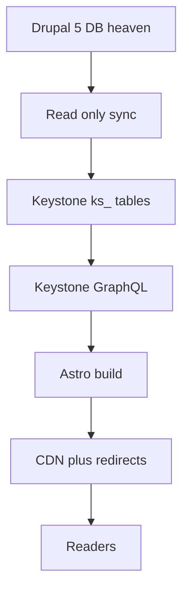

# Orchestrator Mode Roadmap - Heavenletters Migration Keystone + Astro

Version 2.0 Updated 2025-09-29. Replaces legacy GraphQL restart steps with a migration plan aligned to [PROJECT_ROADMAP.md](heavenletters-next-stack/docs/PROJECT_ROADMAP.md).

## Mission
Coordinate safe migration from Drupal 5 to KeystoneJS backend and AstroJS frontend, enforcing DB preservation, SEO permalink continuity, and a simple MVP UI. Use agents to execute phase-gated tasks and stop changes that threaten data integrity.

## Current State Snapshot
- Direction fixed in [PROJECT_ROADMAP.md](heavenletters-next-stack/docs/PROJECT_ROADMAP.md) v3.0.
- Vision documented in [VMA.md](heavenletters-next-stack/docs/VMA.md). Godwriting workshop is out of scope for this migration.
- Legacy GraphQL adapter documented in [CURRENT_STATUS.md](heavenletters-next-stack/docs/CURRENT_STATUS.md) is complete and may be used for parity checks only.
- Development DB runs at 192.168.8.103 3306 as described in [DEVELOPMENT.md](heavenletters-next-stack/docs/DEVELOPMENT.md). Credentials must be moved to environment variables.

## Architecture Path
- Backend KeystoneJS builds new ks_ tables in the existing heaven database without altering Drupal tables.
- AstroJS generates static pages with path based i18n and preserves canonical permalink patterns.
- Future LLM features are prepared in schema fields but not activated in MVP.

## System View

## Agent Responsibilities
- Backend Agent
  - Install and configure KeystoneJS.
  - Define Prisma schema for ks_ tables and run safe pushes.
  - Build the sync pipeline from Drupal to ks_ tables.
- Data Safety Agent
  - Enforce least privilege DB users and backups.
  - Verify no ALTER or DROP on legacy tables.
  - Approve phase gates that touch data.
- Frontend Agent
  - Initialize AstroJS and implement routes, components, search.
  - Integrate with Keystone GraphQL.
- QA Agent
  - Parity checks against legacy.
  - E2E tests for routes and accessibility.
- Release Agent
  - CI CD, infra, redirects, monitoring.

## Phase Gates and Handoffs
- Gate A Safety Preflight required before any write access.
- Gate B Backend Data Model complete before sync.
- Gate C Frontend routes aligned to URL spec before integration.
- Gate D Test suite pass before deployment.
- Gate E Launch checklist signoff by Architect and Data Safety.

## Phase 0 Safety Preflight
Assigned Data Safety Agent
- Create or rotate DB users to remove plaintext secrets from [DEVELOPMENT.md](heavenletters-next-stack/docs/DEVELOPMENT.md).
- Provision a restricted MySQL user for Keystone with CREATE INSERT UPDATE SELECT INDEX on ks_ tables only.
- Take a fresh full backup and verify restore.
- Approve .env usage and secret storage policy.
- Outcome Proof of backup, user privileges, and secret policy committed.

## Phase 2 Backend KeystoneJS
Assigned Backend Agent with Data Safety gate approvals
- 2.1 Keystone install and DB connection
  - Configure to use 192.168.8.103 3306 heaven via environment variables.
  - Prohibit direct connections to local DB during development.
  - Success Keystone boots and reads remote DB.
- 2.2 Prisma schema and safe push
  - Define ks_ prefixed models for Heavenletter and related lists only.
  - Run prisma db push with accept data loss set to false.
  - Success New ks_ tables exist. No change to legacy tables.
- 2.3 Sync pipeline
  - Read only queries from Drupal tables and upsert into ks_ tables.
  - Generate unique English slugs and map translations.
  - Optional store tags and embeddings fields without invoking external models.
  - Success 6,620 records present and linked, with audit logs.
- 2.4 GraphQL exposure
  - Queries by slug, locale, publish number, and lists for archives.
  - Success GraphQL returns expected data from ks_ tables.

## Phase 3 Frontend AstroJS
Assigned Frontend Agent
- 3.1 Project initialization with Tailwind and MDX.
- 3.2 Components for reader pages, archive, search box, language selector.
- 3.3 Routes
  - English canonical slug.html.
  - Translations locale slash slug.html.
- 3.4 Features RSS per locale and social meta.
- Success All pages render cleanly with minimal JS and correct permalinks.

## Phase 4 Integration and Testing
Assigned QA Agent with support from Backend and Frontend
- Content parity
  - Stable sample across locales and eras.
  - Verify body, dates, titles, numbers, and translations.
- Routing and redirects
  - Validate canonical paths and fallback redirects.
- Accessibility and performance
  - Contrast and semantics.
  - Build size and load time goals.
- Success Parity thresholds and quality bars met, original DB unchanged.

## Phase 5 Deployment and Launch
Assigned Release Agent
- Deploy Astro to hosting and Keystone to an app host.
- Configure redirects from legacy to canonical.
- Monitoring and error tracking enabled.
- Success Live traffic served with preserved SEO and stable backend.

## Decision Checkpoints
- Slug policy choose whether to always append publish number to slugs for collision proofing.
- Locale code mapping confirm ISO codes and mapping from legacy.
- Redirect export method choose source of alias mapping and conflict handling.

## Risk Controls and Rollback
- Blockers detected by Data Safety stop gate approval until fixed.
- Rollback means revert DNS or CDN rules and keep Drupal serving.
- No destructive operations allowed on legacy.

## Communication Protocol
- Orchestrator requires status after each phase and before any gate.
- Update [PROJECT_ROADMAP.md](heavenletters-next-stack/docs/PROJECT_ROADMAP.md) when decisions impact scope or success criteria.
- Document validation outputs in MIGRATION_VALIDATION.md and data safety steps in DATA_SAFETY_CHECKLIST.md.

## Progress Tracker
| Phase | Status | Owner |
| 0 Safety Preflight | Pending | Data Safety |
| 2 Backend | Pending | Backend |
| 3 Frontend | Pending | Frontend |
| 4 Integration and Testing | Pending | QA |
| 5 Deployment and Launch | Pending | Release |

## Immediate Next Actions
- Update secrets handling and rotate exposed password from [DEVELOPMENT.md](heavenletters-next-stack/docs/DEVELOPMENT.md).
- Confirm slug and locale decisions and record them in URL_SPEC.md.
- Kick off Phase 2.1 Keystone install once gate approvals are in place.

References
- [PROJECT_ROADMAP.md](heavenletters-next-stack/docs/PROJECT_ROADMAP.md)
- [VMA.md](heavenletters-next-stack/docs/VMA.md)
- [DEVELOPMENT.md](heavenletters-next-stack/docs/DEVELOPMENT.md)
- [CURRENT_STATUS.md](heavenletters-next-stack/docs/CURRENT_STATUS.md)