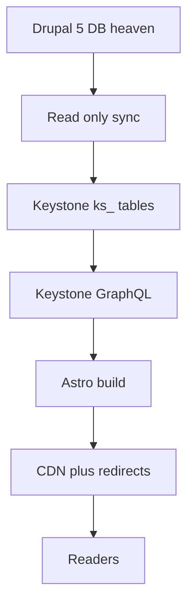

# Migration Status and Gate A Handoff — 2025-10-01

This document records the current project plan and formally hands Gate A (Safety Preflight) to the Orchestrator.

Executive summary
- Target stack: KeystoneJS backend + AstroJS frontend, preserving exact Drupal url_alias .html permalinks.
- Frontend decision reaffirmed; roadmap aligned to Astro.
- Legacy GraphQL adapter complete for parity checks against Drupal 5.
- Gate A approved to start immediately.

Locked decisions and sources
- Direction and phases: [PROJECT_ROADMAP.md](heavenletters-next-stack/docs/PROJECT_ROADMAP.md)
- Canonical URL policy: [URL_SPEC.md](heavenletters-next-stack/docs/URL_SPEC.md)
- Orchestration and gates: [ORCHESTRATOR_ROADMAP.md](heavenletters-next-stack/docs/ORCHESTRATOR_ROADMAP.md)
- Legacy GraphQL parity adapter: [CURRENT_STATUS.md](heavenletters-next-stack/docs/CURRENT_STATUS.md)
- Keystone code entry points: [keystone.ts](heavenletters-next-stack/backend/keystone.ts), [schema.ts](heavenletters-next-stack/backend/schema.ts)
- Environment details (requires sanitization): [DEVELOPMENT.md](heavenletters-next-stack/docs/DEVELOPMENT.md)
- Secrets handling: [SECRETS_POLICY.md](heavenletters-next-stack/docs/SECRETS_POLICY.md), [backend/.env.sample](heavenletters-next-stack/backend/.env.sample)
- Data safety: [DATA_SAFETY_CHECKLIST.md](heavenletters-next-stack/docs/DATA_SAFETY_CHECKLIST.md)
- DBA procedures: [DBA_RUNBOOK_GATE_A.md](heavenletters-next-stack/docs/DBA_RUNBOOK_GATE_A.md)
- Least-privilege grants: [scripts/grant-ks-tables.sh](heavenletters-next-stack/scripts/grant-ks-tables.sh), [db/sql/keystone_least_privilege.sql](heavenletters-next-stack/db/sql/keystone_least_privilege.sql)

System flow (unchanged)

Gate A (Safety Preflight): scope and deliverables
- Sanitize repository docs and configuration
  - Remove plaintext credentials from [DEVELOPMENT.md](heavenletters-next-stack/docs/DEVELOPMENT.md)
  - Add .env usage across backend; add template: [backend/.env.sample](heavenletters-next-stack/backend/.env.sample)
  - Draft a short Secrets Policy: [SECRETS_POLICY.md](heavenletters-next-stack/docs/SECRETS_POLICY.md)
- Rotate secrets
  - Rotate DB password on 192.168.8.103 and update .env (DATABASE_URL); follow [DBA_RUNBOOK_GATE_A.md](heavenletters-next-stack/docs/DBA_RUNBOOK_GATE_A.md)
  - Restrict distribution of rotated secrets to need-to-know
- Provision least-privilege database access
  - Create a MySQL user restricted to ks_% tables only
  - Grants: CREATE, INSERT, UPDATE, SELECT, INDEX; deny ALTER/DROP on legacy Drupal tables
  - Use [scripts/grant-ks-tables.sh](heavenletters-next-stack/scripts/grant-ks-tables.sh) for dynamic grants or [db/sql/keystone_least_privilege.sql](heavenletters-next-stack/db/sql/keystone_least_privilege.sql) for static
- Backups and verification
  - Take a fresh backup of heaven database; verify restore per [DBA_RUNBOOK_GATE_A.md](heavenletters-next-stack/docs/DBA_RUNBOOK_GATE_A.md)
  - Record proof in [DATA_SAFETY_CHECKLIST.md](heavenletters-next-stack/docs/DATA_SAFETY_CHECKLIST.md)
- Documentation outputs
  - Commit [DATA_SAFETY_CHECKLIST.md](heavenletters-next-stack/docs/DATA_SAFETY_CHECKLIST.md) with proof and verification steps
  - Update trackers: [TODO.md](heavenletters-next-stack/docs/TODO.md), [ORCHESTRATOR_ROADMAP.md](heavenletters-next-stack/docs/ORCHESTRATOR_ROADMAP.md)

Acceptance criteria for closing Gate A
- No plaintext secrets remain in repo; [backend/.env.sample](heavenletters-next-stack/backend/.env.sample) and [SECRETS_POLICY.md](heavenletters-next-stack/docs/SECRETS_POLICY.md) committed
- Rotated DB credentials in use; old credentials invalidated
- Least-privilege user configured and tested against ks_% tables; legacy tables protected
- Fresh backup taken; restore verified; steps recorded in [DATA_SAFETY_CHECKLIST.md](heavenletters-next-stack/docs/DATA_SAFETY_CHECKLIST.md)
- Orchestrator sign-off recorded in [ORCHESTRATOR_ROADMAP.md](heavenletters-next-stack/docs/ORCHESTRATOR_ROADMAP.md)

Post Gate A next actions (Phase 2 readiness)
- Finalize Prisma schema for ks_heavenletter (permalink UNIQUE, nid, tnid, locale, dates, tags, embeddings)
- Align Keystone lists and GraphQL queries to URL policy
- Guarded prisma db push with ks_ prefix only and accept-data-loss=false
- Implement read-only sync with collision/anomaly reporting

Ownership and handoff
- Gate owner: Orchestrator
- Implementing agents: Data Safety (lead), Backend (assist)
- This document serves as the formal instruction set for Gate A execution

References
- [PROJECT_ROADMAP.md](heavenletters-next-stack/docs/PROJECT_ROADMAP.md)
- [URL_SPEC.md](heavenletters-next-stack/docs/URL_SPEC.md)
- [ORCHESTRATOR_ROADMAP.md](heavenletters-next-stack/docs/ORCHESTRATOR_ROADMAP.md)
- [CURRENT_STATUS.md](heavenletters-next-stack/docs/CURRENT_STATUS.md)
- [DEVELOPMENT.md](heavenletters-next-stack/docs/DEVELOPMENT.md)
- [SECRETS_POLICY.md](heavenletters-next-stack/docs/SECRETS_POLICY.md)
- [DATA_SAFETY_CHECKLIST.md](heavenletters-next-stack/docs/DATA_SAFETY_CHECKLIST.md)
- [DBA_RUNBOOK_GATE_A.md](heavenletters-next-stack/docs/DBA_RUNBOOK_GATE_A.md)